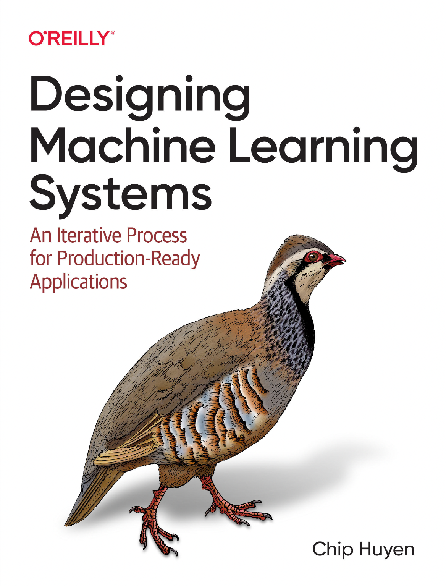

# Designing Machine Learning Systems (Chip Huyen 2022)

<!-- toc -->

<!-- tocstop -->

Machine learning systems are both complex and unique. Complex because they consist of many different components and involve many different stakeholders. Unique because they're data dependent, with data varying wildly from one use case to the next. In this book, you'll learn a holistic approach to designing ML systems that are reliable, scalable, maintainable, and adaptive to changing environments and business requirements.

The book is available on:
- [Amazon](https://www.amazon.com/Designing-Machine-Learning-Systems-Production-Ready/dp/1098107969)
- [O'Reilly](https://www.oreilly.com/library/view/designing-machine-learning/9781098107956/)
- [Kindle](https://www.amazon.com/Designing-Machine-Learning-Systems-Huyen-ebook-dp-B0B1LGL2SR/dp/B0B1LGL2SR/r)

and most places where technical books are sold.

## Repo structure
This book focuses on the key design decisions when developing and deploying machine learning systems. This is NOT a tutorial book, so it doesn't have a lot of code snippets. In this repo, you won't find code examples, but you'll find:
- [Table of contents](ToC.pdf)
- [Chapter summaries](summary.md)
- [MLOps tools](mlops-tools.md)
- [Resources](resources.md)
- [A very short review of basic ML concepts](basic-ml-review.md)

## Contributions
You're welcome to create issues or submit pull requests. Your feedback is much appreciated!

## Who This Book Is For

This book is for anyone who wants to leverage ML to solve real-world problems. ML in this book refers to both deep learning and classical algorithms, with a leaning toward ML systems at scale, such as those seen at medium to large enterprises and fast-growing startups. Systems at a smaller scale tend to be less complex and might benefit less from the comprehensive approach laid out in this book.

Because my background is engineering, the language of this book is geared toward engineers, including ML engineers, data scientists, data engineers, ML platform engineers, and engineering managers.

You might be able to relate to one of the following scenarios:

1. You have been given a business problem and a lot of raw data. You want to engineer this data and choose the right metrics to solve this problem.
2. Your initial models perform well in offline experiments and you want to deploy them.
3. You have little feedback on how your models are performing after your models are deployed, and you want to figure out a way to quickly detect, debug, and address any issue your models might run into in production.
4. The process of developing, evaluating, deploying, and updating models for your team has been mostly manual, slow, and error-prone. You want to automate and improve this process.
5. Each ML use case in your organization has been deployed using its own workflow, and you want to lay down the foundation (e.g., model store, feature store, monitoring tools) that can be shared and reused across use cases.
6. You’re worried that there might be biases in your ML systems and you want to make your systems responsible!
 
You can also benefit from the book if you belong to one of the following groups:

- Tool developers who want to identify underserved areas in ML production and figure out how to position your tools in the ecosystem.
- Individuals looking for ML-related roles in the industry.
- Technical and business leaders who are considering adopting ML solutions to improve your products and/or business processes. Readers without strong technical backgrounds might benefit the most from Chapters 1, 2, and 11.

## Review
- _"This is, simply, the very best book you can read about how to build, deploy, and scale machine learning models at a company for maximum impact. Chip is a masterful teacher, and the breadth and depth of her knowledge is unparalleled."_ - Josh Wills, Software Engineer at WeaveGrid and former Director of Data Engineering, Slack

- _"There is so much information one needs to know to be an effective machine learning engineer. It's hard to cut through the chaff to get the most relevant information, but Chip has done that admirably with this book. If you are serious about ML in production, and care about how to design and implement ML systems end to end, this book is essential."_ - Laurence Moroney, AI and ML Lead, Google

- _"One of the best resources that focuses on the first principles behind designing ML systems for production. A must-read to navigate the ephemeral landscape of tooling and platform options."_ - Goku Mohandas, Founder of [Made With ML](https://github.com/GokuMohandas/MadeWithML)

---

 
 

Chip Huyen, *Designing Machine Learning Systems*. O'Reilly Media, 2022.

    @book{dmlsbook2022,  
        address = {USA},  
        author = {Chip Huyen},  
        isbn = {978-1801819312},   
        publisher = {O'Reilly Media},  
        title = {{Designing Machine Learning Systems}},  
        year = {2022}  
    }
