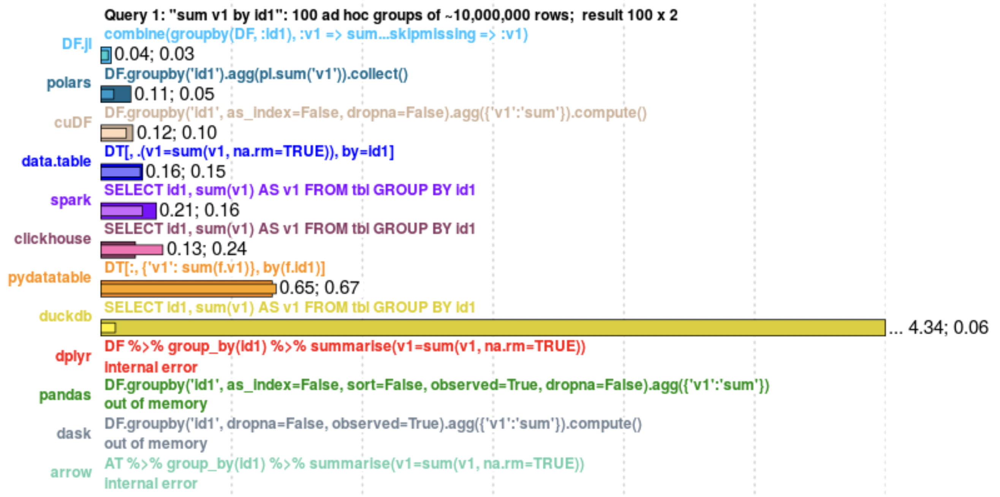

# MLOps Tools

I avoided discussing tools in the book because tooling is ephemeral -- all software will eventually become legacy software. However, I did mention a few tools in my book when they were useful to illustrate a point. Several early readers told me that the book helped them discover several useful tools, and asked me to recommend more, so here is my attempt.

In this doc, I’ll start with long lists of tools other people have compiled. Then we’ll go over a short list of open-source tools that I think are pretty cool. I exclude some of the already well known tools in the data science community to keep the list short. Feel free to open an issue or submit a PR to recommend a new tool. Thank you!

We also have a channel ([#tools-watch](https://discord.gg/Mw77HPrgjF)) on our MLOps Discord to discuss interesting tools.

* [Long lists of MLOps tools](#long-lists-of-mlops-tools)
* [Short lists of MLOps open-source tools](#short-lists-of-MLOps-open-source-tools)
    * [Pandas alternatives](#pandas-alternatives)
    * [Data and features](#data-and-features)
    * [Interpretability and fairness](#interpretability-and-fairness)
    * [Model development and evaluation](#model-development-and-evaluation)
    * [Use case specific frameworks](#use-case-specific-frameworks)
    * [Dev environment](#dev-environment)
    * [DevOps for MLOps](#devops-for-mlops)

# Long lists of MLOps tools

I get it -- there are hundreds of MLOps tools out there. There have been multiple long lists of MLOps tools, each with hundreds so I won’t create another list here. However, if you want a long list of tools, here are some of the more popular resources.

>> **Notes**
>> * Many of these lists were created by vendor-sponsored communities. There’s nothing wrong with taking sponsorships -- communities have operational expenses too -- and being able to get sponsorships is impressive for a community. However, sometimes, there might be conflicts of interests between vendor-sponsorships and vendor-neutral reviews.
>> * Many of these lists divide tools into categories and evaluate them by features. However, the landscape is still evolving quickly, so categories are not yet well-defined. At the same time, best practices are still converging, so it can be hard for companies to delineate what features they need.

1. [MLOps Community’s Learn](https://mlops.community/learn/): currently, it consists of 3 categories (Feature Store, Monitoring, Metadata Storage & Management -- which includes Model Store) with one in progress (Deploy). You can add 2 tools to compare them side-by-side.
2. [TwiML Solutions Guide](https://twimlai.com/solutions/): Tools are grouped into categories with features supported and where they can be deployed.
3. [StackShare](https://stackshare.io/): You can browse different devtools, see what companies are using them, see jobs that mention them, check out alternatives, even read reviews. You can also see the tech stacks of popular tech companies. You can also compare tools side by side. In my opinion, StackShare is what many MLOps solution guides aspire to become, but StackShare is general for all tech stacks, not just MLOps.
4. [AI Infrastructure Landscape](https://ai-infrastructure.org/ai-infrastructure-landscape/): a membership-based foundation that focuses on AI infrastructure (more general than [LFAI & Data](https://lfaidata.foundation/), which focuses on open-source). They do a lot of comprehensive research and analysis on MLOps tooling.
5. Matt Turck’s annual [Machine Learning, AI and Data (MAD) Landscape](https://mattturck.com/data2021/): with high-level analysis from an investor’s perspective.
6. Leigh Marie Braswell’s [Startup Opportunities in Machine Learning Infrastructure](https://leighmariebraswell.substack.com/p/startup-opportunities-in-machine): analysis of the gaps in MLOps landscape from another investor’s perspective.
7. Yours truly’s [MLOps Landscape](https://huyenchip.com/2020/12/30/mlops-v2.html). It comes with a [Google Sheets list](https://docs.google.com/spreadsheets/d/1i8BzE4puGQ3dmQueu4LQCcwaqrulgK1Vb-xeFwhy6gY/edit#gid=0) of 284 tools (last updated in December 2020) and interactive visualization. I stopped maintaining the list because it takes a ton of time and it’s not like no one else is doing it.

# Short lists of MLOps open-source tools

I star cool open source tools whenever I come across them. You can check out the full list [here](https://github.com/chiphuyen?tab=stars). 

**Disclaimer**: this is not supposed to be a comprehensive list.

## Pandas alternatives

Table formats like Pandas DataFrame are great for data manipulation. However, Pandas is [slow](https://stackoverflow.com/search?q=%5Bpandas%5D+slow), [quirky](https://github.com/chiphuyen/just-pandas-things), and doesn’t leverage GPUs. Naturally, there have been many projects aiming to fix these problems. Here are a few of them.

* [modin](https://github.com/modin-project/modin): a drop-in replacement of pandas (using `import modin.pandas as pd` instead of `import pandas as pd`). [Ponder](https://ponder.io/) is working on the enterprise version built on top of it.
* [dask](https://github.com/dask/dask) and [cuDF](https://github.com/rapidsai/cudf): both projects were at some point maintained by the RAPIDS AI team at NVIDIA, until a core developer of dask left NVIDIA to start [Coiled](https://coiled.io/), which provides the enterprise version built on top of dask.
* [Polars](https://github.com/pola-rs/polars/): built with Rust on top of Apache Arrow, Polars promises to be fast!

H2O did a fun [database-like ops benchmark](https://h2oai.github.io/db-benchmark/) (though I hope they’ll consider another color scheme for their graphs).

## Data and features

* Online analytical databases (e.g. if you want to join predictions with user feedback to monitor your model performance in real-time): [ClickHouse](https://github.com/ClickHouse/ClickHouse), [Druid](https://github.com/apache/druid).
* Stream processing: [ksql](https://github.com/confluentinc/ksql), [faust](https://github.com/robinhood/faust), [materialize](https://github.com/MaterializeInc/materialize), [Redpanda](https://github.com/redpanda-data/redpanda) (on WASM)
* Visualization: [D3](https://github.com/d3/d3), [Superset](https://github.com/apache/superset), [Facets](https://github.com/PAIR-code/facets), [redash](https://github.com/getredash/redash), [visdom](https://github.com/fossasia/visdom), [plotly](https://github.com/plotly/plotly.py), [Altair](https://github.com/altair-viz/altair), [pandas-profiling](https://github.com/ydataai/pandas-profiling), [lux](https://github.com/lux-org/lux) (only for DataFrames), [bokeh](https://github.com/bokeh/bokeh)
* Data validation: [Great Expectations](https://github.com/great-expectations/great_expectations), [deepchecks](https://github.com/deepchecks/deepchecks), [pandera](https://github.com/pandera-dev/pandera)
* Labeling: [Snorkel](https://github.com/snorkel-team/snorkel), [Label Studio](https://github.com/heartexlabs/label-studio), [doccano](https://github.com/doccano/doccano)
* Data versioning: [DVC](https://github.com/iterative/dvc), [Dolt](https://github.com/dolthub/dolt), [pachyderm](https://github.com/pachyderm/pachyderm)
* Data hosting for unstructured data: [Hub](https://github.com/activeloopai/Hub)
* Metadata stores (for feature discovery): Lyft’s [Amundsen](https://github.com/amundsen-io/amundsen) and LinkedIn’s [DataHub](https://github.com/datahub-project/datahub).
* Feature stores: [FEAST](https://github.com/feast-dev/feast) (OSS). Several commercial feature stores are built on top of FEAST.
* Data pipelines: [ploomber](https://github.com/ploomber/ploomber), [hamilton](https://github.com/stitchfix/hamilton), [NVTabular](https://github.com/NVIDIA-Merlin/NVTabular)
* The whole [arrow](https://github.com/apache/arrow) and [flight](https://arrow.apache.org/blog/2019/10/13/introducing-arrow-flight/) ecosystem is growing fast!

## Interpretability and fairness

* Interpretability: [SHAP](https://github.com/slundberg/shap), [Lime](https://github.com/marcotcr/lime), [Interpret](https://github.com/interpretml/interpret), [lit](https://github.com/PAIR-code/lit) (for NLP), [captum](https://github.com/pytorch/captum) (PyTorch), [timeshap](https://github.com/feedzai/timeshap), [AIX360](https://github.com/Trusted-AI/AIX360)
* Fairness: [AIF360](https://github.com/Trusted-AI/AIF360)

## Model development and evaluation

* Experiment tracking: [MLflow](https://github.com/mlflow/mlflow), [aim](https://github.com/aimhubio/aim). Most of the tools in this category aren’t open source since the hard part is to host and visualize artifacts. 
* Model optimization: [TVM](https://github.com/apache/tvm), [TensorRT](https://developer.nvidia.com/tensorrt), [Triton](https://github.com/openai/triton), [hummingbird](https://github.com/microsoft/hummingbird), [composer](https://github.com/mosaicml/composer)
* Distributed training: [DeepSpeed](https://github.com/microsoft/DeepSpeed) (super cool), [accelerate](https://github.com/huggingface/accelerate)
* Federated learning: [PySyft](https://github.com/OpenMined/PySyft), [FedML](https://github.com/FedML-AI/FedML), [FATE](https://github.com/FederatedAI/FATE), [TensorFlow Federated](https://www.tensorflow.org/federated)
* Evaluation: [checklist](https://github.com/marcotcr/checklist) (NLP), [reclist](https://github.com/jacopotagliabue/reclist) (recommender systems)
* Online experiments (e.g. A/B testing): [growthbook](https://github.com/growthbook/growthbook), [Ax](https://github.com/facebook/Ax)

## Use case specific frameworks

Just me nerding out on those cool use cases -- don’t mind me.

* Neural recommender systems / CTR: [DLRM](https://github.com/facebookresearch/dlrm), [DeepCTR](https://github.com/shenweichen/DeepCTR), [tensorflow-DeepFM](https://github.com/ChenglongChen/tensorflow-DeepFM), [Transformers4Rec](https://github.com/NVIDIA-Merlin/Transformers4Rec)
* Conversational AI: [rasa](https://github.com/RasaHQ/rasa), [NeMo](https://github.com/NVIDIA/NeMo)
* Similarity search: [annoy](https://github.com/spotify/annoy), [Faiss](https://github.com/facebookresearch/faiss), [Milvus](https://github.com/milvus-io/milvus)
* Deep fakes: [faceswap](https://github.com/deepfakes/faceswap), [deepface](https://github.com/serengil/deepface)
* Time-lagged conversion modeling: [convoys](https://github.com/better/convoys)
* Churn prediction: [WTTE-RNN](WTTE-RNN)
* Survival analysis: [lifelines](https://github.com/CamDavidsonPilon/lifelines)

## Dev environment

* CLI tools: [fzf](https://github.com/junegunn/fzf) (fuzzy search), [lipgloss](https://github.com/charmbracelet/lipgloss)
* IDEs: just use VSCode -- its notebook is pretty good tooo.
* Dependency management: [Poetry](https://github.com/python-poetry/poetry)
* Config management: [Hydra](https://github.com/facebookresearch/hydra), [gin-config](https://github.com/google/gin-config)
* Documentation: [docusaurus](https://github.com/facebook/docusaurus)
* Debugging in Kubernetes: [k9s](https://github.com/derailed/k9s)
* Virtual whiteboard: [excalidraw](https://github.com/excalidraw/excalidraw)

## DevOps for MLOps

* CI/CD: [earthly](https://github.com/earthly/earthly)
* Monitoring: [Sentry](https://github.com/getsentry/sentry), [Prometheus](https://github.com/prometheus/prometheus), [vector](https://github.com/vectordotdev/vector), [M3](https://github.com/m3db/m3)
* Dashboards: [Grafana](https://github.com/grafana/grafana), [Metabase](https://github.com/metabase/metabase)
* General DevOps: [Chaos Monkey](https://github.com/Netflix/chaosmonkey), [k6](https://github.com/grafana/k6)
